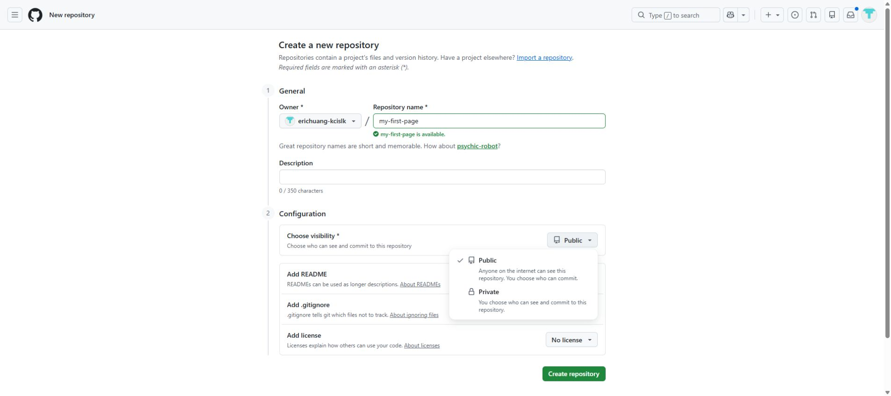
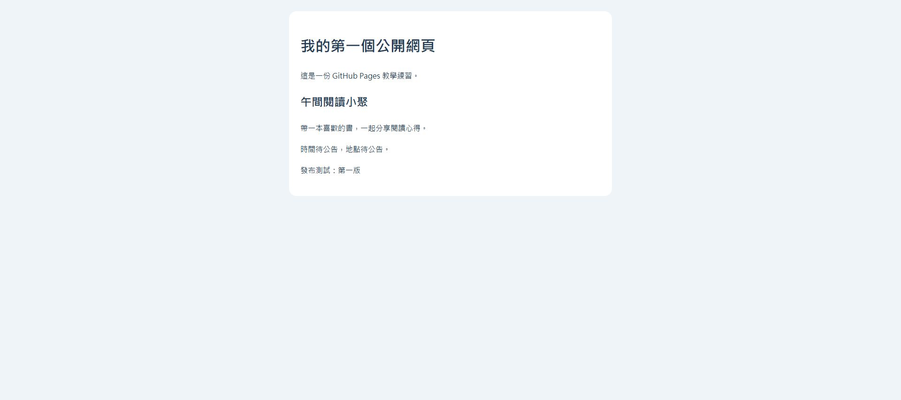
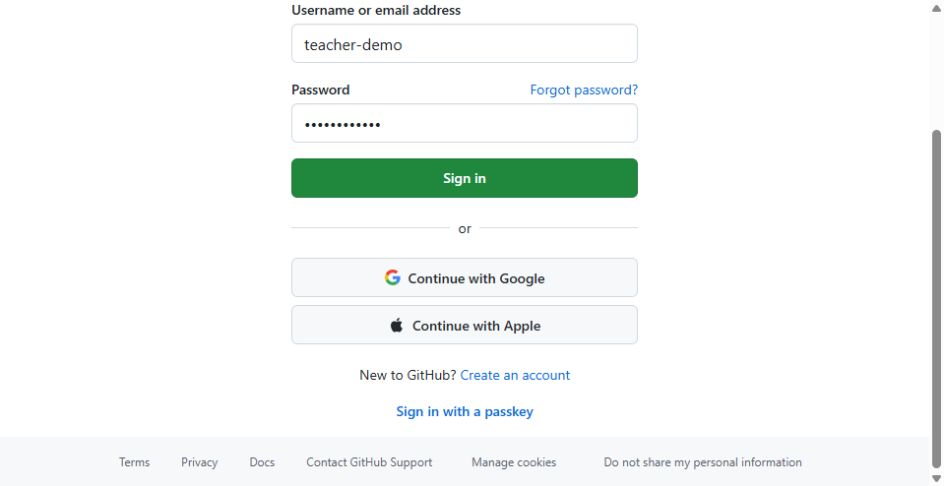
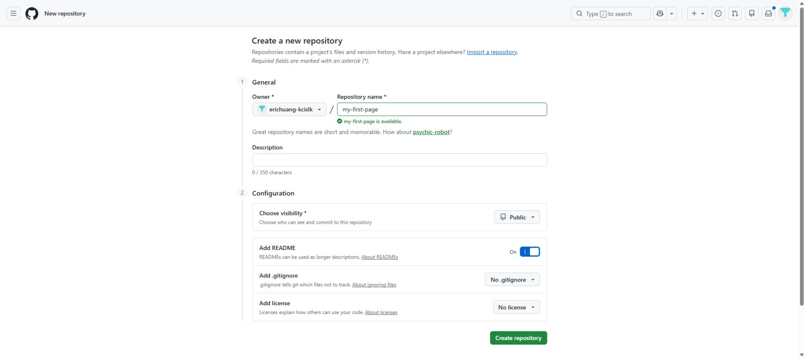
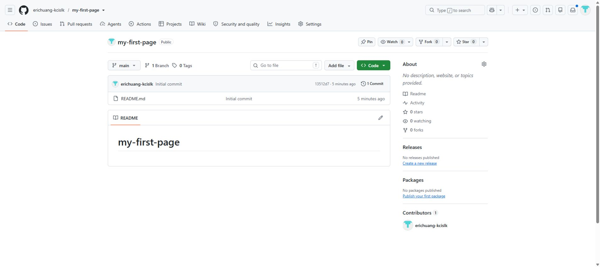
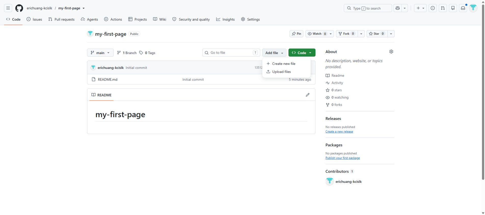
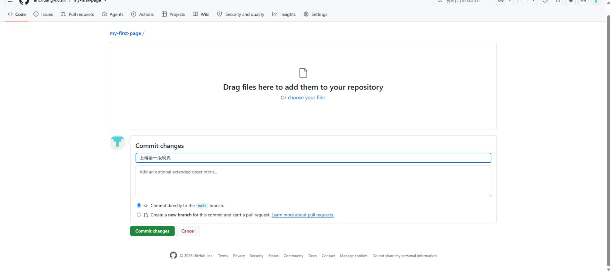
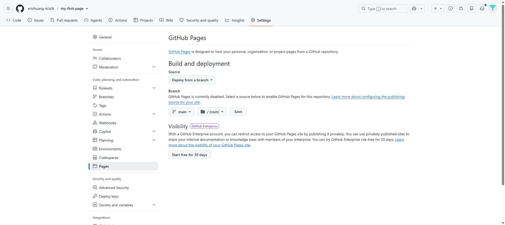

# 把 HTML 變成公開網址：GitHub Pages 新手教學

適合對象：已經有簡單的 HTML 網頁，希望讓別人用網址開啟的同仁。  
操作環境：Windows 電腦、Chrome 或 Edge、GitHub 免費帳號。  
操作流程查核日期：2026-10-05。介面可能調整，請對照本文保留的英文按鈕名稱。

網頁可以用 ChatGPT、Gemini、Claude 或其他 AI 工具製作，也可以是自己寫的。**只要拿到可獨立開啟的 HTML 檔案，就能照著本文操作。** 後面的 Prompt 也可貼給自己習慣的 AI 工具。

**完成後，你會有一個公開網址。別人用手機或電腦開啟，不需要登入 GitHub。**

第一次做，只要照著 **Step 1～Step 7**。後面的更新方法、Prompt 和常見問題，有需要再看。

## GitHub 是什麼？先從你的網頁需求看起

你已經有一份 HTML。現在需要一個地方放它，讓別人用網址打開；也需要知道自己之後改了什麼，方便持續更新。

GitHub 可以幫你把專案檔案存放在網路上、保留修改紀錄，以及與其他人協作。**這次會用到「儲存檔案、記錄修改、發布網頁」三件事。**[GitHub 官方入門介紹](https://docs.github.com/en/get-started/start-your-journey/what-is-github)

### 用一個活動網頁來理解

假設你做了一份「午間閱讀小聚」的活動介紹：

| 你想做的事 | 在 GitHub 怎麼完成 |
|---|---|
| 把 HTML 放到網路上 | 建立一個儲存庫，將 `index.html` 上傳進去。 |
| 記住這次改了什麼 | 存檔時寫一段修改說明，例如「更新活動時間」。 |
| 讓大家直接看活動網頁 | 開啟 GitHub Pages，取得網站網址。 |
| 下次再修改活動內容 | 在同一個儲存庫更新 `index.html`，網站會重新發布。 |

儲存庫除了檔案，也保留修改紀錄。你可以把每次 Commit 想成一次「存下目前版本」，日後回頭查看改動。[GitHub 儲存庫入門](https://docs.github.com/en/repositories/creating-and-managing-repositories/quickstart-for-repositories)

### Git、GitHub、GitHub Pages 有什麼關係？

| 名稱 | 白話說明 | 這次怎麼使用 |
|---|---|---|
| Git | 記錄檔案版本與修改歷程的工具。 | 在 GitHub 網頁存檔，就會留下版本紀錄。 |
| GitHub | 存放與管理專案檔案的網路平台。 | 在瀏覽器裡建立儲存庫、上傳與修改 HTML。 |
| GitHub Pages | GitHub 提供的靜態網站發布服務。 | 將 HTML 變成可開啟的網站網址。 |

本教學直接使用 GitHub 網頁操作，你可以先學會上傳與發布，再依需要學習其他工具。[GitHub 與 Git 的官方說明](https://docs.github.com/en/get-started/start-your-journey/what-is-github)、[GitHub Pages 官方介紹](https://docs.github.com/en/pages/getting-started-with-github-pages/what-is-github-pages)

### 帳號、儲存庫與網址怎麼看？

假設你的 GitHub 使用者名稱是 `teacher-demo`，儲存庫名稱是 `my-first-page`：

```text
GitHub 帳號：teacher-demo
└── 儲存庫：my-first-page
    ├── index.html  ← 你的網頁首頁
    └── README.md   ← 這個專案的說明
```

上面是虛構範例。使用者名稱是帳號識別名稱，可能和你的中文姓名不同；儲存庫名稱則是這個專案的名稱。

| 你看到的名稱 | 這次要記住什麼 |
|---|---|
| Owner | 這個儲存庫屬於哪個帳號。練習時選自己的帳號。 |
| Repository name | 這個專案叫什麼。本文以 `my-first-page` 為例。 |
| `main` | 本文使用的發布分支。上傳檔案與 Pages 都選同一個分支。 |
| `/(root)` | 儲存庫的最外層。`index.html` 要直接放在這裡。 |

例如打開儲存庫後，直接看到 `index.html`，就代表它在最外層；如果還要先點進其他資料夾才看到它，就不符合本文的 `/(root)` 設定。[發布分支與資料夾官方說明](https://docs.github.com/en/pages/getting-started-with-github-pages/configuring-a-publishing-source-for-your-github-pages-site)

### Public 到底公開什麼？

**選 Public 代表任何人都能查看儲存庫的檔案、原始碼與公開的修改紀錄。** 別人可以閱讀或下載；直接修改原本的儲存庫則需要相應權限。你的 GitHub 登入密碼也不會因為選 Public 就公開。[儲存庫公開範圍與權限說明](https://docs.github.com/en/repositories/creating-and-managing-repositories/about-repositories)

| 內容 | 選 Public 並發布後的情況 |
|---|---|
| HTML 上顯示的文字與圖片 | 訪客可以在網站看到。 |
| HTML 裡的程式碼與註解 | 別人可以從公開檔案查看。 |
| 網頁引用的公開檔案 | 別人可以透過連結或儲存庫取得。 |
| 沒有上傳的電腦檔案 | 不會因為這個儲存庫設為 Public 就自動上傳。 |

**畫面對照：Public 和 Private 的差別。** Public 是任何人都能查看；Private 則限制儲存庫的存取對象。本文的免費公開網頁練習選 Public。



所以要確認的是**整份檔案能不能公開**。把文字藏在 HTML 註解裡，或用樣式隱藏，仍可能被看到。

### 這次需要付費嗎？訪客需要帳號嗎？

本文使用 GitHub 免費帳號、Public 儲存庫與 GitHub 提供的 `github.io` 網址，適合簡單的公開靜態網頁。你不需要先購買自己的網址；訪客開啟公開網站時，也不需要登入 GitHub。[Pages 使用條件](https://docs.github.com/en/pages/getting-started-with-github-pages/creating-a-github-pages-site)、[Pages 網址說明](https://docs.github.com/en/pages/getting-started-with-github-pages/what-is-github-pages)

### 進入儲存庫後，先認識這幾個按鈕

| 按鈕或頁籤 | 它是做什麼的 | 什麼時候會用到 |
|---|---|---|
| 上方的 **Code 分頁** | 回到這個儲存庫的檔案清單。 | 上傳或查看 `index.html`。 |
| **Add file** | 新增或上傳檔案。 | 選 `Upload files` 上傳 HTML。 |
| 綠色的 **Code 按鈕** | 下載或連接這個專案。 | 本文主要使用 Add file 上傳。 |
| **Settings** | 調整儲存庫設定。 | 開啟 Pages。 |
| Settings 左側的 **Pages** | 設定網站發布來源、查看網站網址。 | 選分支和資料夾、找到 Visit site。 |
| **Actions** | 查看網站發布工作的進度與結果。 | 發布遲遲沒完成，或需要查錯誤時。 |
| **Commit changes** | 把這次變更正式存到 GitHub。 | 上傳與修改檔案後。 |

等一下的實作會依序使用這些位置。看到不熟悉的頁籤，可以先回到本文這張表對照。

## 這次要完成的流程

```text
準備 HTML 網頁 → 存成 index.html → 上傳到 GitHub → 開啟 Pages → 分享網址
```

**Public 和 Pages 都要設定：選 Public 是公開檔案；開啟 Pages 才會有本文要分享的網站網址。** Public 儲存庫的內容可被任何人存取。[GitHub 儲存庫公開範圍說明](https://docs.github.com/en/repositories/creating-and-managing-repositories/about-repositories)

### 這個方法適合你的網頁嗎？

活動介紹、課程說明、作品展示、簡單計算器，都適合用這個方法。靜態網頁也可以有按鈕、計算或切換內容。

如果網頁需要登入校內帳號、把所有人的資料集中存到資料庫，或請 AI 即時產生新回答，請先請資訊人員確認。這些功能需要額外服務，單靠本教學的 HTML 發布流程無法完成。GitHub Pages 提供的是靜態網站代管。[GitHub Pages 官方介紹](https://docs.github.com/en/pages/getting-started-with-github-pages/what-is-github-pages)

**公開前，請確認網頁與原始碼都可以公開。** 練習用虛構資料；學生名單、電話、校內文件、密碼和 API Key（服務金鑰）不要放進網頁或公開儲存庫。正式校務內容先依校方流程確認可以發布。Public 儲存庫也會保留檔案修改紀錄。[GitHub 儲存庫說明](https://docs.github.com/en/repositories/creating-and-managing-repositories/about-repositories)

## Step 1：把網頁檔案命名為 index.html

**這一步的目標：你的電腦裡有一個叫 `index.html` 的檔案。**

如果你已經下載或拿到 HTML 檔案，照下面做。如果目前只有 AI 工具裡的網頁預覽或程式碼，先做後面的「附錄 A：把程式碼存成 HTML」，再回到 Step 2。

1. 在桌面按滑鼠右鍵，選「新增 → 資料夾」。
2. 把資料夾命名為 `my-first-page`。
3. 把做好的 HTML 檔案**複製** 到這個資料夾。
4. 在檔案總管顯示副檔名。Windows 11 可選「檢視 → 顯示 → 副檔名」；Windows 10 可在「檢視」勾選「副檔名」。
5. 選取複製過來的檔案，按 `F2`，把完整檔名改成 `index.html`。

檔名要全部小寫。請對照：

| 檔名 | 能直接照本文繼續嗎？ |
|---|---|
| `index.html` | 可以。 |
| `Index.html` | 請改成小寫的 `index.html`。 |
| `index.html.txt` | 請把完整檔名改成 `index.html`。 |
| `活動介紹.html` | 請把複製過來的檔案改名為 `index.html`。 |

GitHub Pages 的首頁檔名會區分大小寫；本文統一使用 `index.html`。[首頁檔名官方說明](https://docs.github.com/en/pages/getting-started-with-github-pages/troubleshooting-404-errors-for-github-pages-sites)

**完成後應該看到：** 打開 `my-first-page` 資料夾，就看到 `index.html`。

## Step 2：先在自己的電腦打開看看

**這一步的目標：確認拿到的是可顯示的網頁。**

1. 用滑鼠雙擊 `index.html`。如果沒有用瀏覽器開啟，按右鍵，選「開啟檔案」，再選 Chrome 或 Edge。
2. 看看文字、排版和圖片是否正常。
3. 點一下網頁上的按鈕或連結，確認主要功能能使用。

**完成後應該看到：** 瀏覽器顯示你的網頁。

下面是本文「午間閱讀小聚」練習網頁的本機預覽。這張圖只代表檔案能正常顯示，還要完成後面的上傳與 Pages 設定，才會有公開網址。



現在網址列可能是 `file:///C:/.../index.html`。這代表它還在你的電腦裡，別人無法用這個本機網址開啟。

若畫面只顯示程式碼、出現亂碼，或必須在某個 AI 工具的預覽裡才能運作，先用後面的 **Prompt 1** 整理檔案，再做一次 Step 2。若網頁有另外的圖片或其他檔案，請看後面的「附錄 B：我的網頁還有圖片或其他檔案」。

## Step 3：登入 GitHub

**這一步的目標：可以登入 GitHub，並完成電子郵件驗證。**

### 建議使用學校 Google 帳號建立 GitHub 帳號

**本校已申請 GitHub Campus Program，建議同仁使用學校的 Google 帳號註冊或登入 GitHub，方便後續辨識校內身分與安排帳號加入校方組織。** 校方組織可以想成學校在 GitHub 上共同管理專案的位置。

GitHub 支援用 Google 建立個人帳號。註冊時看到 **Continue with Google**，就是「使用 Google 帳號繼續」的意思。[GitHub 帳號建立官方說明](https://docs.github.com/en/account-and-profile/how-tos/account-management/creating-an-account-on-github)

### 還沒有 GitHub 帳號：照這樣做

1. 打開 [GitHub 註冊頁](https://github.com/signup)。
2. 找到並按 **Continue with Google**。
3. 在 Google 的帳號選擇畫面，選**自己的學校 Google 帳號**。如果同時有私人帳號，請核對選到的是學校帳號。
4. 依畫面指示完成登入與註冊；密碼、驗證碼和授權畫面請自己處理。
5. 如果 GitHub 要你設定使用者名稱，選一個容易辨認的名稱，並記下來。
6. 依指示完成電子郵件或其他必要驗證，再回到 GitHub。

**Google 帳號和 GitHub 使用者名稱可能不同。** 例如你用學校電子郵件登入，GitHub 使用者名稱仍可能是另一個英文名稱；後面建立儲存庫與查看網址時，要看 GitHub 顯示的名稱。

### 已經有 GitHub 帳號：先登入原本的帳號

到 [GitHub 登入頁](https://github.com/login)，使用原本的登入方式。原本透過 Google 建立或已連接 Google 登入的帳號，可按 **Continue with Google**，選當初使用的 Google 帳號。

如果已經有 GitHub 帳號，先沿用它；需要連結學校身分或加入校方組織時，依資訊單位安排處理。

**畫面對照：Continue with Google 與建立帳號入口。** 同仁優先使用學校 Google 帳號；圖中的 `teacher-demo` 與密碼欄都是虛構示範。使用 Google 方式時，直接按 **Continue with Google**。若從登入頁開始，**Create an account** 可以帶你到註冊頁。



### GitHub Campus Program 和帳號有什麼關係？

GitHub Campus Program 是提供學校使用 GitHub 的機構方案，包含符合方案條件的 GitHub Enterprise 服務。**同仁先有自己的 GitHub 帳號，再由校方依啟用方式安排組織成員與使用權限。** 實際可用功能與加入方式，以資訊單位的通知為準。[GitHub Campus Program 官方說明](https://docs.github.com/en/education/about-github-education/use-github-at-your-educational-institution/about-github-campus-program)

| 這件事 | 它代表什麼 |
|---|---|
| 用學校 Google 帳號註冊 GitHub | 建立自己的 GitHub 帳號，方便校內身分辨識。 |
| 加入校方指定的 GitHub 組織 | 取得校方安排的共同專案存取權限。 |
| GitHub Campus Program | 由校方申請、依校方啟用與管理方式使用的機構方案。 |
| 個人的 GitHub Education 優惠 | 依個別方案資格另行申請與驗證。 |

本次練習先在**自己的個人帳號** 建立儲存庫即可。之後要放入校方共用組織時，再依資訊單位安排操作。

**用學校 Google 帳號登入，並不代表所有個人教育優惠都會自動開通。** 例如個人的 Copilot 教育優惠等，依 GitHub 的申請資格與驗證結果辦理。[GitHub 學校方案與個人優惠說明](https://github.com/education/schools)

**完成後應該看到：** 登入後的 GitHub 畫面，右上角可以開啟自己的帳號選單。使用者名稱可以在個人頁面的網址中找到，例如 `github.com/你的帳號`。

註冊細節與驗證方式以當下畫面為準。GitHub 的部分基本操作需要已驗證的電子郵件。[GitHub 帳號註冊官方說明](https://docs.github.com/en/account-and-profile/how-tos/account-management/creating-an-account-on-github)

## Step 4：建立一個 Public 儲存庫

**這一步的目標：在 GitHub 建立網站的檔案位置。**

1. 登入後，打開 [建立新儲存庫](https://github.com/new)。
2. 按照下表填寫。
3. 按 **Create repository**。

| 畫面欄位 | 這次怎麼填 |
|---|---|
| Owner，擁有者 | 選自己的帳號。 |
| Repository name，儲存庫名稱 | `my-first-page` |
| Description，說明 | 可不填。 |
| Visibility／Choose visibility，公開範圍 | 選 **Public**。 |
| Add README／Add a README file | 開啟或勾選，讓儲存庫先有一個初始檔案。 |
| 其他選項 | 先維持預設。 |

**畫面對照：確認 Owner、Repository name、Public 與 Add README。** 圖中的 `erichuang-kcislk` 是示範帳號，請換成自己的帳號。最後按右下方的 **Create repository**。



如果出現名稱已被使用，換成 `my-first-page-2`。之後的網址也要使用你實際填寫的名稱。

**完成後應該看到：** 自己的儲存庫頁面，標示 **Public**，檔案清單裡有 `README.md`。它只是初始說明檔，保留即可。



GitHub 免費帳號使用 Pages 時，儲存庫需要設為 Public。[建立 Pages 網站官方說明](https://docs.github.com/en/pages/getting-started-with-github-pages/creating-a-github-pages-site)

## Step 5：上傳 index.html

**這一步的目標：讓 `index.html` 出現在儲存庫最外層。**

1. 在剛建立的儲存庫，點上方的 **Code**，回到檔案清單。
2. 點 **Add file → Upload files**。
3. 點 **choose your files**。
4. 從電腦的 `my-first-page` 資料夾選取 **index.html 這個檔案**。
5. 在下方的修改說明欄，輸入 `上傳第一版網頁`。
6. 如果畫面詢問要存到哪裡，選 **Commit directly to the main branch**，直接存到 `main`。
7. 按 **Commit changes**，完成儲存。

本教學使用自己新建的練習儲存庫，直接存到 `main`。如果在單位既有儲存庫操作，請依該儲存庫的協作規則處理。

**畫面對照：Code 分頁右側的 Add file → Upload files。** 請確認目前開啟的是自己剛建立的 Public 練習儲存庫。



**畫面對照：選檔、填修改說明、存到 main。** 上方的 **choose your files** 用來選檔；下方第一個文字欄填 `上傳第一版網頁`，確認 **Commit directly to the main branch**，再按 **Commit changes**。圖中尚未選檔；實際操作時，先確認畫面已列出待上傳的 `index.html`。



**請上傳檔案本身。** 不要把外面那層 `my-first-page` 資料夾或 ZIP 壓縮檔當成首頁上傳。

完成後，儲存庫最外層應該長這樣：

```text
my-first-page 儲存庫
├── index.html
└── README.md
```

**完成後應該看到：**`index.html` 和 `README.md` 出現在同一層；左上方分支選單顯示 `main`。

本文以 `main` 為例。如果你的儲存庫使用其他分支名稱，上傳時與下一步 Pages 設定選同一個實際名稱即可。

上傳介面的按鈕位置可能調整，重點是將檔案存到 `main`。[GitHub 網頁上傳檔案官方說明](https://docs.github.com/en/repositories/working-with-files/managing-files/adding-a-file-to-a-repository)

## Step 6：開啟 GitHub Pages

**這一步的目標：請 GitHub 把這份 HTML 發布成網站。**

1. 在儲存庫上方，點 **Settings**。如果沒看到，先找頁籤旁的更多選單。
2. 在左側選單，點 **Pages**。
3. 找到 **Build and deployment** 區塊。
4. 在 **Source** 選 **Deploy from a branch**。
5. 在 **Branch** 選 **main**。
6. 在旁邊的資料夾選單選 **/(root)**。
7. 按 **Save**。

設定完成時，請對照這三個值：

| 設定 | 要選的值 | 白話意思 |
|---|---|---|
| Source | `Deploy from a branch` | 用儲存庫裡的檔案發布。 |
| Branch | `main` | 使用我們剛剛存檔的位置。 |
| Folder | `/(root)` | 使用儲存庫最外層的檔案。 |

**畫面對照：上方 Settings → 左側 Pages → 右側發布設定。** 圖中選好了 `Deploy from a branch`、`main` 和 `/(root)`；最後按 **Save**。這次只需要設定上方的 **Build and deployment** 區塊。



**完成後應該看到：** 設定已儲存，Branch 顯示 `main`，資料夾顯示 `/(root)`。GitHub 接著會處理發布。[Pages 發布設定官方說明](https://docs.github.com/en/pages/getting-started-with-github-pages/configuring-a-publishing-source-for-your-github-pages-site)

## Step 7：取得公開網址，確認別人也能開啟

**這一步的目標：拿到可分享的網址，並確認網站真的公開了。**

1. 儲存 Pages 設定後，先等幾分鐘。
2. 重新整理 **Settings → Pages** 頁面。
3. 找到 **Visit site** 或顯示的網站網址。
4. 點 **Visit site**，確認是你的網頁。
5. 複製瀏覽器網址列的網址。
6. 開一個無痕／InPrivate 視窗，貼上網址，確認沒有登入 GitHub 也能看。
7. 再用手機打開一次，看看文字、圖片和按鈕是否正常。

發布可能需要最多約 10 分鐘。第一次開啟遇到 404，可以等發布完成後再試；若持續失敗，請看後面的常見問題。[Pages 網站查看與等待時間官方說明](https://docs.github.com/en/pages/getting-started-with-github-pages/creating-a-github-pages-site)

### 你要分享的是哪一個網址？

| 網址樣子 | 用途 |
|---|---|
| `https://github.com/你的帳號/my-first-page` | 管理檔案、修改設定用的儲存庫頁面。 |
| `https://你的帳號.github.io/my-first-page/` | **讓別人看網站，要分享這個。** |

上面是網址格式範例，不能原樣使用。**直接複製 Visit site 開啟的實際網址最方便。** 本教學建立的是專案網站，網址包含儲存庫名稱。[GitHub Pages 網址官方說明](https://docs.github.com/en/pages/getting-started-with-github-pages/what-is-github-pages)

### 分享前，勾完這四項

- [ ] 公開網址顯示我的網頁。
- [ ] 無痕／InPrivate 視窗不登入也能開啟。
- [ ] 手機上的文字、圖片、主要按鈕都正常。
- [ ] 網頁與原始碼內容都已確認可以公開。

**這四項完成，就可以分享網站網址。**

## 之後怎麼更新網頁？

請沿用原本的儲存庫。保留帳號、儲存庫名稱和 `index.html` 檔名，網站網址就可以沿用。

自行修改或請 AI 改好內容後，先把新版存到電腦、打開確認，再更新 GitHub：

1. 開啟原本的儲存庫，點 **Code**。
2. 點 **index.html**。
3. 點右上方的**鉛筆圖示**，進入編輯畫面。
4. 點程式碼編輯區，按 `Ctrl + A` 選取內容，再貼上**完整新版 HTML**。
5. 點 **Commit changes**。
6. 輸入這次修改的說明，例如 `更新活動介紹`。
7. 選直接存到 `main`，再按 **Commit changes**。
8. 等發布完成後，打開原本的公開網址，確認新內容。

只複製 HTML 程式碼；程式碼框外面的說明文字和三個反引號不要貼進去。GitHub 可直接編輯檔案；發布來源更新後，Pages 會重新發布。[檔案編輯官方說明](https://docs.github.com/en/repositories/working-with-files/managing-files/editing-files)、[Pages 自動更新說明](https://docs.github.com/en/pages/getting-started-with-github-pages/configuring-a-publishing-source-for-your-github-pages-site)

如果仍看到舊畫面，先確認發布完成，再按 `Ctrl + F5` 重新載入，或用無痕視窗開啟。電腦裡的新版檔案也要保留，方便下次修改。

## 通用 AI Prompt：選一段直接貼

Prompt 就是「給 AI 的指令」。把下面的指令貼給自己習慣的 AI 工具，先替換方括號裡的內容，一次使用一段。原本用 AI 做網頁的人，優先回到同一段對話，讓它參考原作品；如果換了工具或開新對話，請一併貼上目前的 HTML 程式碼。

本文採用文字對話與複製程式碼。若使用的 AI 工具暫時無法回覆，或遇到使用額度限制，可先用附錄 A 的小範例練習 GitHub 操作。

### Prompt 1：把現有作品整理成一個可發布的 HTML

**什麼時候用：** 只有 AI 工具裡的網頁預覽、拿到多個程式檔，或不確定能不能放到 GitHub Pages。

```text
請幫我把目前這個網頁整理成可以放到 GitHub Pages 的版本。
我是完全沒有程式背景的新手，請用繁體中文與白話說明。

請先檢查目前網頁是否依賴特定 AI 平台的專用功能、登入、資料庫、API Key 或其他服務。
如果有無法靠單一靜態 HTML 完成的功能，先用白話告訴我限制，讓我確認調整方式。
其餘可保留的文字、排版和瀏覽器內互動，請盡量保留。

完成版本請符合：
1. 只有一個 index.html，樣式與互動程式都寫在同一個檔案。
2. 不需要安裝工具、執行 npm、編譯或啟動伺服器。
3. 不依賴外部程式套件、特定 AI 平台的專用功能或電腦裡的檔案路徑。
4. 使用繁體中文、UTF-8，手機也能正常顯示。
5. 若有無法一起提供的圖片，請標出並提出簡單的替代方式，不要假裝已附上圖片。
6. 在一般回覆中給我完整 HTML 程式碼，從 <!DOCTYPE html> 到 </html>，不要省略，也不要只給修改片段。

如果你看不到原作品，請先告訴我要補上哪些程式碼，不要自行猜測內容。
```

**拿到回答後：** 依附錄 A 存成檔案，雙擊開啟，確認文字與主要功能都有保留。AI 說可以發布，仍要實際打開檢查。

### Prompt 2：還沒有作品，先做一個練習網頁

**什麼時候用：** 希望先用虛構內容走完整個發布流程。

```text
請幫我製作一個「午間閱讀小聚」的單頁活動介紹網頁。
這是教學練習，所有內容都是虛構的，請在頁面標示「練習用網頁」。

內容包含：活動簡介、三項活動特色、活動時間與地點。
時間寫「時間待公告」，地點寫「地點待公告」。
不要加入報名表、登入、個人資料、AI 功能或外部圖片。
版面簡單、字體清楚，手機也能閱讀。

請使用繁體中文，給我一份完整的 index.html。
樣式寫在同一個檔案，設定 UTF-8，不依賴外部套件，不需要安裝或編譯。
從 <!DOCTYPE html> 到 </html> 全部給我，不要省略程式碼。
```

**拿到回答後：** 存成 `index.html`，從 Step 2 開始。

### Prompt 3：我卡在某個 GitHub 畫面，請一次教我一個動作

**什麼時候用：** 畫面跟教材稍有不同，不知道下一個按鈕在哪裡。

```text
我正在用 GitHub 網頁版，把 index.html 發布到 GitHub Pages。
這是我自己新建的 Public 練習儲存庫，首頁檔案要放在 main 的最外層。
我是完全沒有程式背景的新手。

我現在做到：[填入教材 Step 編號]
畫面標題是：[填入畫面上的標題]
我看得到的按鈕或選項是：[填入按鈕或選項文字]

請一次只告訴我一個動作，包含「按哪裡」與「按完應該看到什麼」。
等我回覆完成，再教下一步。
不要給我指令或要求安裝工具。如果資訊不足，先問我一個必要的問題。
```

**拿到回答後：** 對照自己實際看到的畫面操作。提供畫面資訊時，不要貼出密碼、驗證碼或憑證。

### Prompt 4：公開網址出現 404

**什麼時候用：** 已設定 Pages，但網址顯示找不到網頁。

```text
我的 GitHub Pages 網址出現 404。請用新手聽得懂的方式幫我確認。

網站網址：[填入 Visit site 的網址]
儲存庫是否為 Public：[是／否]
Code 頁面目前選的分支：[填入]
檔案清單最外層的檔名：[照畫面填入，保留大小寫]
Pages 的 Source：[填入]
Pages 的 Branch：[填入]
Pages 的 Folder：[填入]
按 Save 之後等了多久：[填入]
Actions 最新發布狀態或錯誤文字：[填入；不知道就寫不知道]

請依我提供的資訊找出需要修正的地方，先教我一個最有幫助的動作。
沒有證據的原因請說尚未確認，不要一次列出大量猜測。
```

**拿到回答後：** 先確認實際檔名、檔案位置與發布狀態，再重新開啟網址。

### Prompt 5：公開後圖片不見、排版跑掉

**什麼時候用：** 自己的電腦看起來正常，公開網址卻少了圖片或樣式。

```text
我的網頁在自己電腦可以看，但放到 GitHub Pages 後圖片不見或排版不同。
網站網址：[填入]
我實際上傳的檔案與資料夾：[填入，例如 index.html、images/banner.jpg]
目前異常是：[描述哪張圖片或哪個區塊]

請檢查下面的 HTML，確認圖片與樣式是否指向正確的位置。
請使用適合專案網址的相對路徑，並核對檔名大小寫。
不要使用 C:、D:、file:/// 等電腦路徑，也不要把未上傳的檔案當成已存在。
如果缺少檔案，請清楚告訴我要補上什麼。
需要修改程式碼時，請給我完整的新版 index.html。

以下是目前的完整 HTML：
[在這裡貼上 HTML 程式碼]
```

**拿到回答後：** 補上需要的檔案、更新 HTML，再用公開網址查看。

### Prompt 6：修改已公開網頁的文字

**什麼時候用：** 想更新活動說明，保留原本的版型。

```text
請修改下面的網頁，只調整我指定的內容：
[填入，例如：把主標題改成「閱讀小聚活動介紹」]

請保留其他文字、排版與原本可用的功能。
維持單一 index.html、繁體中文、UTF-8、手機可閱讀。
不加入外部套件、API 或其他服務。
請提供完整新版 HTML，不要只給修改片段。

以下是目前的完整 HTML：
[在這裡貼上 HTML 程式碼]
```

**拿到回答後：** 先在自己的電腦確認，再依「之後怎麼更新網頁」替換 GitHub 上的內容。

### Prompt 7：公開前，請幫我找出要人工確認的地方

**什麼時候用：** 即將分享網址，希望多做一次檢查。

```text
請幫我檢查下面準備公開的 HTML。我已先移除不適合提供給 AI 的資料。

請用表格列出：檢查項目、你看到的內容、需要我確認的地方。
檢查是否有個人資料、密碼或 API Key、電腦檔案路徑、未上傳的圖片、
錯誤日期、空白連結，以及看起來可以送出但實際無法送出的表單。
請提醒我哪些按鈕和手機畫面需要實際打開測試。
你沒有實際測試的項目，請標示「需要人工測試」，不要寫成已通過。
先列出問題，不要自行修改 HTML。

以下是 HTML：
[在這裡貼上 HTML 程式碼]
```

**拿到回答後：** 自己核對內容與授權，實際測試；AI 的檢查結果不能代替人工確認。

### Prompt 8：手機上的字太小、畫面太寬

**什麼時候用：** 電腦版正常，手機卻需要左右滑動或放大。

```text
請幫我調整下面的 HTML，讓手機也容易閱讀。
目前手機上的問題是：[填入，例如字太小、內容超出畫面]

請保留原本內容與功能，調整字體、間距、圖片寬度和排版。
確認有設定手機需要的 viewport，內容盡量避免左右滑動。
維持單一 index.html、繁體中文、UTF-8，不加入外部套件。
請給我完整新版 HTML，不要只給修改片段。

以下是目前的完整 HTML：
[在這裡貼上 HTML 程式碼]
```

**拿到回答後：** 更新公開網頁，再用自己的手機實際看一次。

## 常見問題：先看符合你的那一列

| 你遇到的狀況 | 先做這件事 |
|---|---|
| 按過 Save，卻找不到 Visit site | 等幾分鐘，再重新整理 Settings → Pages。 |
| 公開網址顯示 404 | 確認最外層有小寫 `index.html`，Pages 使用 `main` 和 `/(root)`，並且發布已完成。 |
| 打開後是 README 的說明文字 | 確認 `index.html` 已存到 `main` 最外層；若沒有，回到 Step 5 上傳。 |
| 打開後看到一堆程式碼 | 檢查完整檔名是否真的是 `index.html`，並移除誤貼的程式碼框標記；檔案內容只保留 HTML。 |
| Branch 選單沒有 main | 回到 Code 頁看實際分支名稱，Pages 選同一個名稱。若儲存庫還沒有檔案，先完成初始存檔或上傳。 |
| 找不到 Settings 或 Pages | 確認是在自己的儲存庫，並找頁籤更多選單；使用別人的儲存庫需要管理權限。 |
| 圖片不見了 | 確認圖片也有上傳，路徑和檔名大小寫都一致，參考附錄 B。 |
| 更新後還是舊版 | 先確認新內容已存到 `main`、發布已完成，再用無痕視窗或 `Ctrl + F5` 查看。 |
| 電腦正常，手機畫面很擠 | 用 Prompt 8 調整，更新後再用手機看一次。 |
| AI 回覆只有半段程式碼 | 請它先把網頁簡化，再給完整檔案；不要把不完整內容直接發布。 |

若已等超過 10 分鐘且仍無法開啟，可到儲存庫上方 **Actions**，看最新的 Pages 發布工作是否完成。通常可看到名稱含 `pages build and deployment` 的項目；若工作失敗，記下錯誤文字交給資訊人員，或填入 Prompt 4。成功狀態通常以綠色勾號顯示。[發布工作與錯誤查看說明](https://docs.github.com/en/pages/getting-started-with-github-pages/configuring-a-publishing-source-for-your-github-pages-site)

## 附錄 A：把程式碼存成 HTML

**已經有 `index.html` 檔案的人，可以跳過。** 這段給目前只有 AI 工具裡的網頁預覽或程式碼的人。

### A-1：先拿到完整 HTML

1. 打開你製作網頁時使用的 AI 工具，回到原本的對話。
2. 貼上 **Prompt 1**，請 AI 提供完整、可獨立開啟的 HTML。如果使用別的工具或新對話，請一併貼上目前的程式碼。
3. 在回答中找到 HTML 程式碼，使用程式碼框的複製功能，或用滑鼠選取程式碼後複製。

如果 AI 只顯示網頁預覽，請再貼上這一句：

```text
請在對話回覆中直接貼出完整的 index.html 程式碼，從 <!DOCTYPE html> 到 </html>，不要省略，也不要只提供預覽或分享連結。
```

你要複製的內容通常從 `<!DOCTYPE html>` 開始，到 `</html>` 結束。**只複製程式碼，不要複製外面的說明文字、程式碼框標記或 AI 工具的分享網址。** 取得程式碼後，依下面的記事本步驟存檔即可。

### A-2：用記事本存檔

1. 在桌面建立 `my-first-page` 資料夾。
2. 從 Windows 開始選單搜尋並開啟「記事本」。
3. 把完整 HTML 貼進記事本。
4. 點「檔案 → 另存新檔」。
5. 儲存位置選剛建立的 `my-first-page` 資料夾。
6. 依下表設定存檔欄位。
7. 按「儲存」。

| 存檔欄位 | 要填的內容 |
|---|---|
| 檔案名稱 | `index.html` |
| 存檔類型 | 「所有檔案」；有些版本顯示 `所有檔案 (*.*)`。 |
| 編碼 | `UTF-8` |

**請用記事本存檔。** 存完後，在檔案總管顯示副檔名，確認完整檔名是 `index.html`，再回到 Step 2。

### A-3：先用這個小範例練習

把下面整段複製到記事本，依 A-2 存檔。這份內容是虛構練習，沒有圖片或外部服務。

```html
<!DOCTYPE html>
<html lang="zh-Hant">
<head>
  <meta charset="UTF-8">
  <meta name="viewport" content="width=device-width, initial-scale=1">
  <title>我的第一個公開網頁</title>
  <style>
    body {
      margin: 0;
      padding: 24px;
      font-family: system-ui, sans-serif;
      line-height: 1.8;
      color: #243b53;
      background: #eef4f8;
    }
    main {
      max-width: 640px;
      margin: 0 auto;
      padding: 24px;
      border-radius: 16px;
      background: white;
      overflow-wrap: anywhere;
    }
    h1 { font-size: clamp(1.5rem, 5vw, 2rem); }
  </style>
</head>
<body>
  <main>
    <h1>我的第一個公開網頁</h1>
    <p>這是一份 GitHub Pages 教學練習。</p>
    <h2>午間閱讀小聚</h2>
    <p>帶一本喜歡的書，一起分享閱讀心得。</p>
    <p>時間待公告，地點待公告。</p>
    <p>發布測試：第一版</p>
  </main>
</body>
</html>
```

公開成功後，可以把「發布測試：第一版」改成「發布測試：第二版」，練習更新，再用公開網址確認文字已改變。

## 附錄 B：我的網頁還有圖片或其他檔案

**只有一個 HTML 檔案的人，可以跳過。** 如果你的網頁另外使用圖片、CSS 或 JavaScript，這些被引用的檔案也要一起上傳。

例如，你的 HTML 裡有這一行：

```html

```

它的意思是：到 `images` 資料夾找 `banner.jpg`。GitHub 上就需要保持這個位置：

```text
my-first-page 儲存庫
├── index.html
├── README.md
└── images
    └── banner.jpg
```

操作方式：

1. 在電腦上確認 `index.html` 旁邊有 `images` 資料夾，裡面有 `banner.jpg`。
2. 回到 GitHub 儲存庫最外層，點 **Add file → Upload files**。
3. 從檔案總管把 **images 資料夾** 拖進上傳區。
4. 確認待上傳清單保留 `images/banner.jpg` 的位置。
5. 填寫修改說明，直接存到 `main`，按 **Commit changes**。

上傳功能可接受檔案或資料夾；請留意選到的層級。[GitHub 檔案上傳官方說明](https://docs.github.com/en/repositories/working-with-files/managing-files/adding-a-file-to-a-repository)

請使用自己有權使用並公開的圖片。`banner.jpg` 和 `Banner.JPG` 是不同的檔名；HTML 裡寫的名稱要與上傳檔案一致。

網頁路徑寫成 `images/banner.jpg` 或 `./images/banner.jpg`。以 `/images/banner.jpg` 開頭會指向網站網域的最外層，對本文含儲存庫名稱的網址，可能找錯位置。`C:\...`、`D:\...` 或 `file:///...` 只指向電腦裡的檔案，別人無法使用。

## 如果暫時不想公開網站

1. 到儲存庫的 **Settings → Pages**。
2. 找到顯示網站網址的區塊，點旁邊的 **⋯** 選單。
3. 選 **Unpublish site**，依畫面確認取消發布。

取消後，目前的網站部署會被移除。原本的發布設定仍會保留；之後更新發布來源、產生新部署時，網站可以重新公開。[取消發布官方說明](https://docs.github.com/en/pages/getting-started-with-github-pages/unpublishing-a-github-pages-site)

**取消 Pages 發布後，Public 儲存庫裡的檔案仍是公開的。** 如果誤放個資或憑證，請立即通知資訊人員協助處理，不要只刪除網頁上的文字就認為已處理完成。
