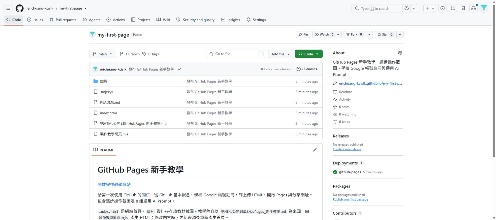
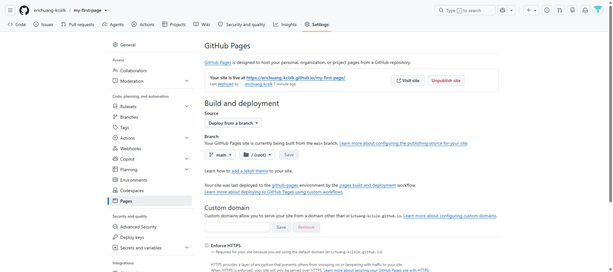

# 把 HTML 變成公開網址：GitHub Pages 新手教學

已經做好網頁了嗎？照下面 7 個步驟，就能取得一個可以分享的網址，別人不用登入也能看。

準備好你的 HTML 檔案和學校 Google 帳號，從 Step 1 開始。

## Step 1：登入 GitHub

GitHub 是存放網頁檔案的平台。這次會用它的 GitHub Pages 功能，把你的網頁公開到網路上。

本校已申請 GitHub Campus Program，建議使用學校 Google 帳號。日後需要數位發展中心協助調整網頁或安排共同管理時，方便確認你的帳號。

還沒有 GitHub 帳號，照這樣做：

1. 打開 [GitHub 註冊頁](https://github.com/signup)。
2. 按 **Continue with Google**，選擇自己的學校 Google 帳號。
3. 依畫面完成註冊。需要填使用者名稱時，取一個容易記住的名稱。
4. 如果收到驗證信，打開信件，依指示完成驗證。

已經有帳號的人，直接到 [GitHub 登入頁](https://github.com/login)，用原本的方式登入，不必再建立一個。

下圖的 **Continue with Google** 就是 Google 登入入口。圖中的帳號與密碼是虛構範例。


登入後，右上角會出現自己的帳號選單，就可以繼續了。

## Step 2：把檔案命名為 index.html

1. 在桌面建立一個資料夾，命名為 `my-first-page`。
2. 把做好的 HTML 檔案複製到這個資料夾。
3. 在檔案總管開啟「檢視」，勾選「副檔名」。Windows 11 要先點「顯示」。
4. 選取 HTML 檔案，按 `F2`，把完整檔名改成 `index.html`。

檔名全部用小寫，確認最後沒有多出 `.txt`。

<details>
<summary>只有 AI 提供的程式碼，還沒有檔案？點這裡</summary>

先用後面的 [「取得完整 HTML」指令](#ai-prepare)，請 AI 給你完整的網頁程式碼，再照下面存檔：

1. 開啟 Windows 的「記事本」。
2. 貼上完整 HTML 程式碼。不要把 AI 的說明文字或程式碼框標記一起貼進去。
3. 點「檔案 → 另存新檔」，儲存位置選桌面的 `my-first-page` 資料夾。
4. 檔案名稱填 `index.html`。
5. 存檔類型選「所有檔案」，編碼選 `UTF-8`。
6. 按「儲存」，回到資料夾確認檔名。

</details>

做到這裡，打開 `my-first-page` 資料夾，應該看得到 `index.html`。

## Step 3：先在自己的電腦打開看看

1. 用滑鼠連按兩下 `index.html`。
2. 如果沒有用瀏覽器開啟，按右鍵，選「開啟檔案」，再選 Chrome 或 Edge。
3. 看看文字、圖片和排版是否正常；有按鈕的話，也點一下試試看。

下面是練習網頁的畫面，你會看到自己做的內容。


確認網頁正常再繼續。目前的檔案還在自己的電腦裡，下一步才會上傳到網路。

## Step 4：建立專案，放網頁檔案

一個網站用一個專案來存放檔案。GitHub 畫面上寫的 Repository，就是這裡的專案。

1. 打開 [建立專案的頁面](https://github.com/new)。
2. **Owner** 選自己的帳號。圖片裡是示範帳號，請用你自己的。
3. **Repository name（專案名稱）** 填 `my-first-page`。這個欄位要用英文。
4. **Description（專案說明）** 填中文名稱「教學－我的第一個網頁」。
5. **Visibility** 選 **Public**。
6. 開啟或勾選 **Add README**，其他欄位先維持原樣。
7. 按 **Create repository**。

<details>
<summary>專案怎麼命名？看簡單範例</summary>

中文名稱用「用途－主題」，讓自己和協助的同仁一眼就知道這個專案是做什麼的。

| 中文名稱，填在 Description | 英文名稱，填在 Repository name |
|---|---|
| 教學－我的第一個網頁 | `my-first-page` |
| 活動－午間閱讀小聚 | `activity-reading` |
| 課程－英文練習 | `course-english` |

英文名稱用小寫，單字之間加半形短橫線 `-`，不加空格。GitHub 的這個欄位只接受英文字母、數字及 `.`、`-`、`_`，中文請填在 Description。

</details>

Public 表示上傳的檔案誰都看得到。請不要上傳學生個資、校內文件或密碼。


圖片裡的專案說明留白；你可以在 Description 補上自己的中文名稱。

如果名稱已被使用，可以改成 `my-first-page-2`。

完成後會進入專案頁面，檔案清單裡有 `README.md`，先保留它就好。


## Step 5：上傳 index.html

1. 在剛建立的專案，點上方的 **Code**。
2. 點 **Add file → Upload files**。


3. 點 **choose your files**，選桌面 `my-first-page` 資料夾裡的 `index.html`。
4. 確認畫面已列出 `index.html`，在下方說明欄輸入「上傳第一版網頁」。
5. 如果畫面詢問存到哪裡，選 **Commit directly to the main branch**。
6. 按 **Commit changes**，把檔案存到 GitHub。

下圖是上傳畫面。選好檔案後，再按 **Commit changes**。圖中尚未選檔，請先完成第 3 步。


請選 `index.html` 檔案本身，不要上傳外面那層資料夾或 ZIP 壓縮檔。

回到檔案清單，確認 `index.html` 和 `README.md` 在同一層。下圖只要找這兩個檔案，其他是示範網站的教材。



## Step 6：開啟網頁發布功能

1. 點專案上方的 **Settings**。
2. 點左側的 **Pages**。
3. 找到 **Build and deployment**，照下表選好設定。
4. 按 **Save**。

| 畫面欄位 | 要選的值 |
|---|---|
| Source | `Deploy from a branch` |
| Branch | `main` |
| 旁邊的資料夾選單 | `/(root)` |

這一步照著選就好。


按完 Save，先留在這個頁面，等網站發布。

## Step 7：取得網址，分享給別人

1. 等幾分鐘，再重新整理 **Settings → Pages** 頁面。
2. 看到 **Your site is live at** 或 **Visit site** 後，點 **Visit site**。
3. 確認開啟的是你的網頁，複製瀏覽器網址列的網址。
4. 開一個無痕視窗，貼上網址，確認不用登入也能看。再用手機打開一次。

第一次發布可能需要約 10 分鐘。如果暫時顯示 404，可以等一下再試。



分享 **Visit site 開啟的網址**，裡面會有 `github.io`。這就是別人看網頁用的網址。

這份教學也是用同樣的方法公開的：[開啟教學網站](https://erichuang-kcislk.github.io/my-first-page/)。

確認文字、圖片和主要按鈕都正常，就可以把你的網址分享出去。

## 需要 AI 幫忙時，複製這些指令

選需要的一段展開，貼到你習慣的 AI 工具。若要接著修改原本的作品，回到製作網頁時的那段對話最方便。

<details id="ai-prepare">
<summary>1. 取得完整 HTML</summary>

只有網頁預覽，或不確定拿到的檔案能不能上傳時，可以用這段：

```text
請把目前的網頁整理成可以上傳到 GitHub Pages 的單一 index.html。
保留原本內容，使用繁體中文，讓手機也能閱讀。
請提供完整 HTML 程式碼，不要只給修改片段或預覽連結。
如果有需要登入或其他服務才能使用的功能，請先用白話告訴我限制，再讓我決定怎麼調整。
也請幫這個專案取一個「用途－主題」的中文名稱，以及適合填在 GitHub 的簡短英文名稱。
```

拿到程式碼後，回到 Step 2 存成檔案，再開啟檢查。

</details>

<details id="ai-next">
<summary>2. 操作卡住，請 AI 教下一步</summary>

先把方括號裡的內容換成你的情況，再貼給 AI：

```text
我正在照教學，把 HTML 上傳到 GitHub Pages。
目前做到 Step [填步驟編號]。
我看到的畫面或錯誤是：[填畫面上的文字，也可附上已遮住個資的截圖]。
我沒有程式背景，請用繁體中文，一次只教我一個動作。
告訴我按哪裡、按完會看到什麼，等我完成再教下一步。
請用 GitHub 網頁操作，不要要求我安裝工具或輸入程式指令。
```

</details>

<details id="ai-edit">
<summary>3. 修改網頁內容</summary>

```text
請幫我修改這個網頁：[填想改的內容]。
保留其他內容和原本可用的功能，使用繁體中文，讓手機也能閱讀。
請給我完整新版 index.html，不要只給修改片段。
以下是目前的 HTML：
[貼上目前的完整 HTML 程式碼]
```

改好後，先在電腦打開確認，再依下方的方法更新。

</details>

## 之後要更新，或操作遇到問題時

<details>
<summary>之後怎麼更新網頁？</summary>

沿用原本的專案，網站網址就可以繼續使用。

1. 開啟專案，點 `index.html`。
2. 點右上方的鉛筆圖示。
3. 點程式碼編輯區，按 `Ctrl + A`，貼上完整新版 HTML。
4. 點 **Commit changes**，輸入「更新網頁內容」。
5. 選 **Commit directly to the main branch**，再按 **Commit changes**。
6. 等幾分鐘，重新打開原本的公開網址，確認內容已更新。

只貼 HTML 程式碼，不要把 AI 的說明文字一起貼進去。

</details>

<details>
<summary>畫面跟教學不同，或網址打不開？</summary>

| 遇到的情況 | 先這樣做 |
|---|---|
| 找不到 Settings | 確認是在自己建立的專案；也可以找上方的「⋯」選單。 |
| Pages 裡找不到 main | 先完成 Step 5，上傳 `index.html`。 |
| 網址顯示 404 | 等發布完成，再確認有小寫的 `index.html`，Pages 設定是 `main` 與 `/(root)`。 |
| 網頁有開，但圖片不見了 | 圖片可能沒有一起上傳。請 AI 整理檔案，或請數位發展中心協助。 |
| 改完還是舊畫面 | 等幾分鐘，再用無痕視窗開啟。 |

還是卡住的話，記下做到哪一步、畫面上的文字和網站網址，交給數位發展中心協助。截圖前先遮住個資，密碼與驗證碼不用提供。

</details>

<details>
<summary>不小心放了不該公開的內容？</summary>

請立即聯絡數位發展中心。若要先暫停網站，到 **Settings → Pages**，點 **Unpublish site**；部分介面會放在「⋯」選單裡。

暫停網站後，Public 專案裡的檔案仍是公開的，需要一併處理。

</details>

<details>
<summary>參考來源與示範專案</summary>

- [這份教學的示範專案](https://github.com/erichuang-kcislk/my-first-page)
- [GitHub 官方：建立帳號](https://docs.github.com/en/account-and-profile/how-tos/account-management/creating-an-account-on-github)
- [GitHub 官方：建立專案與命名限制](https://docs.github.com/en/repositories/creating-and-managing-repositories/creating-a-new-repository)
- [GitHub 官方：上傳檔案](https://docs.github.com/en/repositories/working-with-files/managing-files/adding-a-file-to-a-repository)
- [GitHub 官方：設定 Pages](https://docs.github.com/en/pages/getting-started-with-github-pages/configuring-a-publishing-source-for-your-github-pages-site)
- [GitHub 官方：修改檔案](https://docs.github.com/en/repositories/working-with-files/managing-files/editing-files)
- [GitHub 官方：暫停網站發布](https://docs.github.com/en/pages/getting-started-with-github-pages/unpublishing-a-github-pages-site)

</details>
